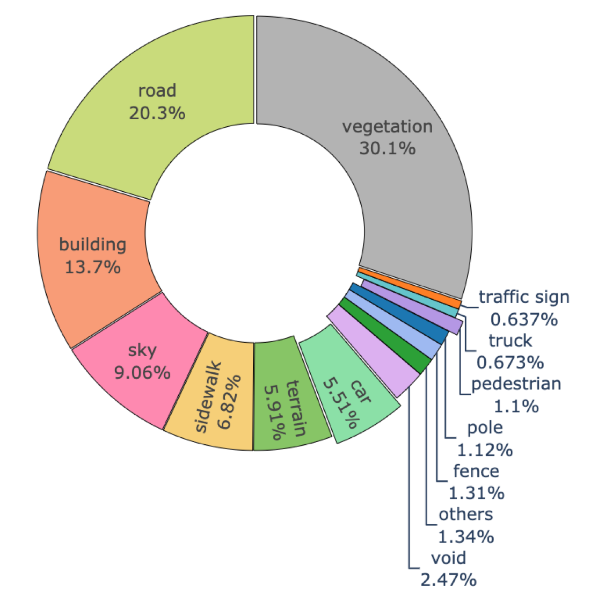
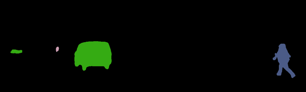

# Diffusion Models vs Learnable Kernels for Video Panoptic Segmentation
## Ceraolo Martorella Minini DLAV2023 Final Project

## Introduction - What’s Video Panoptic Segmentation?
 Panoptic segmentation is an advanced computer vision task that combines instance segmentation and semantic segmentation to provide a comprehensive understanding of the visual scene in a video. It aims to label every pixel in the video with a class label and an instance ID, thereby differentiating between different objects and identifying their boundaries. This task involves simultaneously segmenting and tracking "things" (individual objects) and "stuff" (background regions). Handling temporal coherence and tracking objects across frames are important considerations to achieve accurate and consistent segmentation results. It plays a crucial role in various applications, including autonomous driving, video surveillance, augmented reality, and robotics, enabling machines to perceive and interpret the environment more comprehensively.


## Approach - two different architectures
The two methods that we studied and worked on are Pix2Seq-D and Video K-Net.

### Pix2Seq-D - Diffusion Models for VPS
The paper proposes a generalist approach to panoptic segmentation. The authors present a formulation of panoptic segmentation as a discrete data generation problem, without relying on specific task-related biases. They use a diffusion model based on analog bits, which is a probabilistic generative model, to represent panoptic masks. The proposed model has a simple and generic architecture and loss function, making it applicable to a wide range of panoptic segmentation tasks. By leveraging the power of the diffusion model and incorporating temporal information, the proposed approach offers a promising alternative for panoptic segmentation tasks without the need for task-specific architectures or loss functions.


### Video K-Net - Video Panoptic Segmentation with Learnable Kernels
Video K-Net is a framework for fully end-to-end video panoptic segmentation. The method builds upon K-Net, a technique that unifies image segmentation using learnable kernels. The authors observe that the learnable kernels from K-Net, which encode object appearances and contexts, can naturally associate identical instances across different frames in a video. This observation motivates the development of Video K-Net, which leverages kernel-based appearance modeling and cross-temporal kernel interaction to perform video panoptic segmentation.


## History - our project
We believe that the idea behind it is incredibly fascinating and powerful, and that’s why we were very keen on working with it, notwithstanding the issues we had. We spent several weeks trying to run the Tensorflow code provided by Google Research, but we encountered numerous issues that prevented us from using their code (see the section #issues for more details). We tried a huge amount of solutions, different setups, several GPUs and GPU providers, and so on, without success. So more recently, we decided to embark on an ambitious mission: rewriting the Pix2Seq-D codebase in PyTorch. Fortunately, individual contributors on Github already converted some sub-parts of the project (e.g. Bit-diffusion). After some heavy work, we actually managed to have a draft of the full project. It is now running the training for the very first time, so we don’t expect perfect results yet. We plan on pursuing and completing this project also after the milestone deadline.
 In parallel, since we knew about the uncertainty of such a challenge, we also setup and run the training of another architecture, Video K-net, so that we also have good outputs to show, and a baseline performance to compare the results of our main contribution.


## Contribution overview
Our main contribution is within the Pix2Seq-D architecture. The contributions are three: the re-implementation of the whole codebase in Pytorch, the adaptation of the architecture to the task of Video Panoptic Segmentation, and the idea of improving the architecture by conditioning on the difference between the current frame and the previous one, together with the previous panoptic mask. We also ran the training of another architecture, Video K-net, in order to have a solid benchmark, with same pre-training and training, and become familiar with the panoptic mask generation process.


- First of all, we believe that our re-implementation in Pytorch can help the scientific community, ensuring more interoperability, clarity, and extending the audience that can build solutions on top of Pix2Seq-D. Diffusion models are very recent and proved to be very powerful, so the more researchers can have access to resources and codebases, the faster innnovations will come. 


- Secondly, we adapted the codebase to the task of Video Panoptic Segmentation. The authors of the paper used it for Image Panoptic Segmentation and Video Segmentation, but not for Video Panoptic Segmentation. We believe that this is a very interesting task, and that the diffusion model can be very powerful for it. We are very curious to see the results of our training, and we plan on running it for several epochs, and then also on other datasets.

- Thirdly, our endgoal is to try to improve Pix2Seq-D. The solution they propose to do Video Panoptic Segmentation is by using the Diffusion process, and when predicting the frame at time t, they guide the diffusion by conditioning on the previous panoptic mask. Our idea is the following: instad of conditioning only on the previous mask, we plan on finding a way to compute the difference between the current frame and the previous one, and condition on such difference, together with the previous mask. The idea is that, given two frames, it is very likely that there will not be extreme changes, but mainly instances that moved by some pictures. The difference between the frames will highlight what changed, and hence may make the diffusion process to find the mask faster, and more accurate. Since we had to re-write the whole codebase, we were not able to implement such configuration yet.

Finally, we ran another architecture, Video K-net, in order to have a solid benchmark, with same pre-training and training, and become familiar with the panoptic mask generation process.


## Experimental setup
With both architectures, we kept consistency of the training procedure. In both cases, we used the following experimental setup:
- Backbone: ResNet50 pre-trained on ImageNet
- pre-training on Cityscapes
- training on KITTI-step
See the following section for more information on datasets.

In the Video K-net case, we used the checkpoints provided by the authors of the paper for the pre-training on Cityscapes. In the Pix2Seq-D case, we ran the pre-training on Cityscapes ourselves from scratch, and then also the training on KITTI-STEP for Video Panoptic Segmentation.

We both did qualitative and quantitative evaluations. The qualitative comprised creating a script to visualize a gif video to see the colored panoptic masks. The quantitative comprised the following measures:
- Video Panoptic Quality (VPQ) 
- Segmentation and Tracking Quality (STQ)

Finally, since the training processes were heavy, we used powerful GPUs. More specifically, we used:
- an RTX3090 for Video K-net
- one A100 of 80GB for Pix2Seq-D

## Data
The dataset used for pre-training is Cityscapes. Cityscapes dataset is a high-resolution road-scene dataset which contains 19 classes. (8 thing classes and 11 stuff classes). It contains 2975 images for training, 500 images for validation and 1525 images for testing.

Our pre-training for Pix2Seq-D was done with the images in .png format. The dataset can be downloaded with the [official scripts](https://github.com/mcordts/cityscapesScripts)


The dataset used for training is KITTI-STEP. 
It can be obtained from this [Huggingface link](https://huggingface.co/LXT/VideoK-Net/tree/main), thanks to the authors of Video K-net. We obtained the dataset from there both for training Pix2Seq-D and Video K-net. This dataset contains videos recorded by a camera mounted on a driving car. KITTI-STEP has 21 and 29 sequences for training and testing, respectively. The training sequences are further split into training set (12 sequences) and validation set (9 sequences). Since the sequence length sometimes reaches over 1000 frames, long-term tracking is required. Prior research has shown that with increasing sequence length, the tracking difficulty increases too.
The labels of the dataset, which are the panoptic masks, are provided in .png format. More specifically, the groundtruth panoptic map is encoded as follows in PNG format:

```
R = semantic_id
G = instance_id // 256
B = instance % 256
```

The following is the label distribution in KITTI-STEP (image taken from "STEP: Segmenting and Tracking Every Pixel" paper):





## Results
Qualitative and Quantitative results of your experiments. 

### Qualitative evaluation

### Video K-net (on train set)
The following are the masks obtained with Video K-net, pretrained on Cityscapes and trained on KITTI-STEP.

Inference is done on a sequence of the train set of KITTI-STEP. The first video is the input, the second is the predicted instance segmentation mask, the third is the predicted semantic segmentation mask, the fourth is the predicted panoptic segmentation mask, and the fifth is the overlay of the predicted panoptic mask on the input video.





### Video-k-net (on val set)
Here, inference is done on a sequence of the validation set of KITTI-STEP. The model used is the same as above.


### Pix2Seq-D (on train set)
The following are the masks obtained with our implementation of Pix2Seq-D, pretrained on Cityscapes and trained on KITTI-STEP.

Inference is done on a sequence of the train set of KITTI-STEP. The first video is the input, the second is the predicted instance segmentation mask, the third is the predicted semantic segmentation mask, the fourth is the predicted panoptic segmentation mask, and the fifth is the overlay of the predicted panoptic mask on the input video.


### Pix2Seq-D (on test set)
Here, inference is done on a sequence of the validation set of KITTI-STEP. The model used is the same as above.


### Quantitative evaluation 

The following are the quantitative results obtained with our implementation of Pix2Seq-D, pretrained on Cityscapes and trained on KITTI-STEP.

|                             | STQ     | AQ     |
|-----------------------------|---------|--------|
| Our Results (Video K-net)    | 0.66    | 0.69   |
| Our Results (Pix2Seq)       | /NA     | /NA    |
| Authors' Results (Video K-net)| 0.71    | 0.70   |


## Code
Here you can find the link to our implementation of Pix2Seq-d: Link to repo 1 
Here you can find the link to our repository for Video K-net: Link to repo 2

## Side notes: issues we had
We believe it can be useful to share with the EPFL community the issues that we encountered while running Tensorflow code, both on SCITAS and on external GPU providers.

- The computational load of the training was very high and thus we cannot run the code on our machines, as memory got filled almost immediately. 

- Thus, we had been trying to run the code on the Izar cluster but we encountered lots of issues there as well. Mainly, there were issues with setting up the environment and having the right packages installed and working together without conflicts. Eventually, we did manage to install the right versions of the packages, but still there was an issue with the path of a certificate required by tensorflow. 

- To solve this issue, we set up Docker on the cluster but we could not build the docker image, since the instructions and line commands found on the SCITAS documentation were outdated. 
- We tried to solve this issue by contacting the technical desk, but unfortunately they have not been able to find an effective solution and they refused to add a symlink on the cluster, which would have solved our issue. 
- The technical desk has contacted us again and they proposed some other solutions, but at that point it was too late to try them out because of the restricted reserved slots.

- In the meanwhile, we also tried alternatives to run the code. We tried to run it on cloud computing services such as Colab and Kaggle, but each of them has its own problems. Colab does not offer enough GPU memory, Kaggle does but the training breaks because of an issue with a tensorflow library.

All this problems brought us to the conclusion that the best solution was to convert the codebase to Pytorch, which is more flexible and easier to run on different platforms. We also found the best solution to run the code on GPUs, which external pay-per-use GPUs, namely runpod.io.
